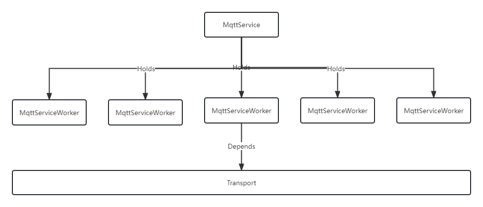

- [整体设计](#整体设计)
  - [Classical](#classical)
  - [SharedWorker](#sharedworker)
  - [结论](#结论)
- [核心类型](#核心类型)
- [React 组件](#react-组件)
  - [Debug](#debug)

## 整体设计



**MqttService是单例模式，每个BrowserTab有且仅有一个MqttService实例。MqttService负责创建MqttServiceWorker实例，而每个React组件都有自己对应的MqttServiceWorker。**

**默认情况下，MqttService会创建一个共享的Transport，所有的MqttServiceWorker复用这个Transport。**

**目前我们支持两种不同类型的Transport，分别是：**

- ClassicalTransport
- SharedWorkerTransport

### Classical

在经典模式下，一个Browser tab只有一个MqttService对象实例，MqttService会创建一个共享的MqttTransport，MqttTransport创建一个MqttClient。经典模式下，每个Browser tab各自维护自己的MqttClient ID。


依赖关系如下所示：

```
BrowserTab -> MqttService -> MqttTransport -> MqttClient
```

整个体系的逻辑结构如下：

```
        |- BrowserTab -> MqttService -> MqttTransport -> MqttClient
Browser |- BrowserTab -> MqttService -> MqttTransport -> MqttClient
        |- BrowserTab -> MqttService -> MqttTransport -> MqttClient
```

消息流如下：

```
        |- BrowserTab <- MqttService <- MqttTransport <- MqttClient
Browser |- BrowserTab <- MqttService <- MqttTransport <- MqttClient
        |- BrowserTab <- MqttService <- MqttTransport <- MqttClient
```

每个React组件都有自己对应的MqttServiceWorker：


```
                       |-> MqttServiceWorker
WebPage |- MqttService |-> MqttServiceWorker
                       |-> MqttServiceWorker
```

### SharedWorker

在基于SharedWorker的模式中，一个Browser tab只有一个MqttService对象实例，MqttService会创建一个共享的SharedWorkerTransport，SharedWorkerTransport则会创建一个SharedWorker

依赖关系如下所示：

```
BrowserTab -> MqttService -> SharedWorkerTransport -> SharedWorker
```

整个体系的逻辑结构如下：

```
        |- BrowserTab -> MqttService -> SharedWorkerTransport -|
Browser |- BrowserTab -> MqttService -> SharedWorkerTransport -|-> SharedWorker
        |- BrowserTab -> MqttService -> SharedWorkerTransport -|
```

消息流如下：

```
        |- BrowserTab <- MqttService <- SharedWorkerTransport <-|
Browser |- BrowserTab <- MqttService <- SharedWorkerTransport <-|- SharedWorker
        |- BrowserTab <- MqttService <- SharedWorkerTransport <-|
```

每个React组件都有自己对应的MqttServiceWorker：

```
                       |-> MqttServiceWorker
WebPage |- MqttService |-> MqttServiceWorker
                       |-> MqttServiceWorker
```

### 结论

- Classical模式下，服务端的压力较大，需要给每个Browser tab创建client id，订阅并且推送消息。
- SharedWorker模式下，服务端压力较小，所有Browser tab共享同一个client id。

## 核心类型

1. MqttService
2. MqttServiceWorker
3. Transport
4. BusinessReferenceManager

**MqttService**

单例模式，全局只有一个MqttService对象，主要职责：

1. Mqtt模块的初始化
2. 实例化全局唯一的共享Transport对象
3. 实例化Worker，回收Worker，释放各种资源
4. 处理来自于共享Transport的各种异常，比如断开链接，重连等
5. 切换不同浏览器Tab页的时候，挂起Transport；在浏览器切换回原来的Tab页之后，重新链接Transport

其他

1. 初始化
  - 在t800.tsx进行初始化，分别在 未登录/登录 的情况下注入实例
2. 调用killMqttService退出
  - projects\platform\src\utils\index.ts#logoutEffect， 用户主动注销登录
  - projects\platform\src\utils\api.js#code === 600057， 用户token过期
  - projects\platform\src\t800.tsx#code === 600057， 用户token过期

示例代码

```ts
import { MqttEvent, useMqttService } from "@platform/core/infra";

async function _createWorker() {
  const mqttService = useMqttService();
  const transport = await mqttService.createTransport();
  const worker = mqttService.createWorker(transport);
  const listeners = new Map([
    [
      MqttEvent.Connect,
      new Set([
        {
          thisArg: worker,
          func: (...args) => {
            // worker && transport is ready
            // mqtt topic u would like to subscribe, but please remember, we have to append some prefix at the head of your topic
            const yourTopic = transport.getTopic("#");
            // could call transport.subscribe so you could receive mqtt messages from mqtt broker
            transport.subscribe(yourTopic);
          },
        },
      ]),
    ],
  ]);
  listeners.forEach((callable, event) => {
    callable.forEach((c) => {
      worker.addEventListener(event, c);
    });
  });
  worker.transport.connect();
  return worker;
}
```

**MqttServiceWorker**

每一个UI组件都会分配单独的一个Worker，UI组件被释放之后，由MqttService进行回收释放，主要职责：

1. 负责Mqtt消息的发送
2. 接收到Mqtt消息后，消息的处理

示例代码

```ts
import { useEffect, useRef } from "react";
import { isEmpty, isEqual } from "lodash";

import type { MqttAbility } from "@platform/components/with_mqtt_service";
import {
  transformTopic,
  withMqttService,
} from "@platform/components/with_mqtt_service";
import { IMP_WEB_SUBJECT } from "@platform/core/infra";

type _YourPageProps = MqttAbility & {
  // your props here
};

// please remember message is different from subject to subject
type TMqttMessage = {
  alarmState: number;
  deviceId: string;
  properties: Record<string, any>;
  spaceFilterCode: string;
  status: string;
  topic: string;
};

const yourSubject = IMP_WEB_SUBJECT.LAYOUT_DEVICE_STATUS;

function _YourPage(props: _YourPageProps) {
  const {
    isMqttInited = false,
    mqttJSON,
    notifySubOrUnSubToEndApi = () => void 0,
  } = props;

  const mqttRef = useRef<TMqttMessage>();

  useEffect(() => {
    if (!notifySubOrUnSubToEndApi || !isMqttInited) {
      return;
    }

    notifySubOrUnSubToEndApi(true, {
      topic: yourSubject,
      bid: "", // your bid here
    });
  }, [notifySubOrUnSubToEndApi, isMqttInited]);

  useEffect(() => {
    const reduxStateName = transformTopic(yourSubject);
    const { payload } = (mqttJSON || {})[reduxStateName] || {};

    if (isEmpty(payload)) {
      return;
    }

    if (isEqual(payload, mqttRef.current)) {
      return;
    }

    mqttRef.current = payload;

    console.log("🚀 layout - mqtt推送", payload);
  }, [mqttJSON]);

  return <div>your react ui component here</div>;
}

const YourPage = withMqttService({
  topics: [
    // for example
    yourSubject,
  ],
  isConnectMqtt: false,
})(_YourPage);

export default YourPage;
````

**Transport**

基于MQTT实现的数据通道，消息的准备、处理由上层应用通过事件机制来决定。主要职责：

1. 连接Mqtt Broker
2. 收发消息

## React 组件

withMqttService，主要职责：

1. 调用`MqttService.init`初始化`MqttService`
2. 为每个React UI单独分配Worker，并且注入对相应的方法和属性，提供兼容层，兼容原先MQTTRedux的props

**代码文件**

projects\platform\src\components\with_mqtt_service\index.tsx

### Debug

**Classical**

略，直接上控制台Debug

**SharedWorker**

[Debugging Web Workers](https://lihautan.com/Debugging%20web%20workers/)

**BusinessReferenceManager**

当前MQTT的设计当中，支持两种模式，分别是：

- Classical
- SharedWorker

但是不论时哪一种情况下，都会有这么一个场景：


```ts
Browser
  |-BrowserTab
    |-Frame(aka projects\platform\src\components\Layout\frame\frame.tsx)
      |-Page A
        |-Component AA
        |-Component BB
        |-Component CC
```

BrowserTab持有全局单例的MqttService实例，每个Component AA则会由MqttService分配自己专享的MqttServiceWorker。

AA和BB都关注了同一个subject的Business，他们的bid可能相同或者不同。

**bid相同**

如果AA从UI上移除，此时与AA组件绑定的MqttServiceWorker调用unwatch方法，通知API取消关注业务反馈，并且通知MqttService回收和AA组件绑定的MqttServiceWorker。
 此时由于API不再推送相关业务的消息，BB组件就会受到影响。

**bid不同**

这个时候Broker推送的消息，AA和BB都会接收到，因为无法根据bid进行区分是不是属于自己的消息。

我们必须决定什么样的时机，可以调用API，通知服务端不必再推送相关的消息。这个时机，就是当subject|bid构成的business对象引用数量为0的时候。

BusinessReferenceManager就是干这个工作的。
